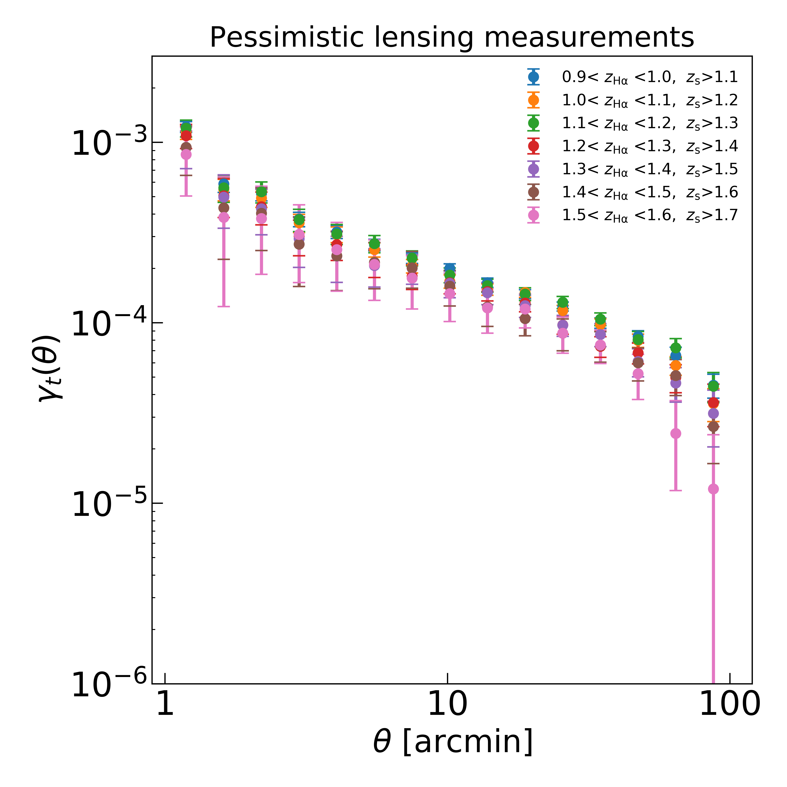
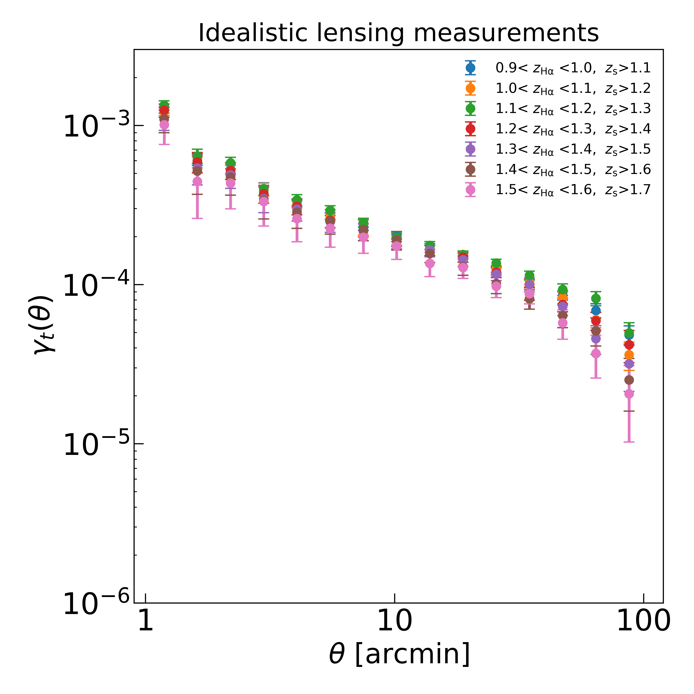
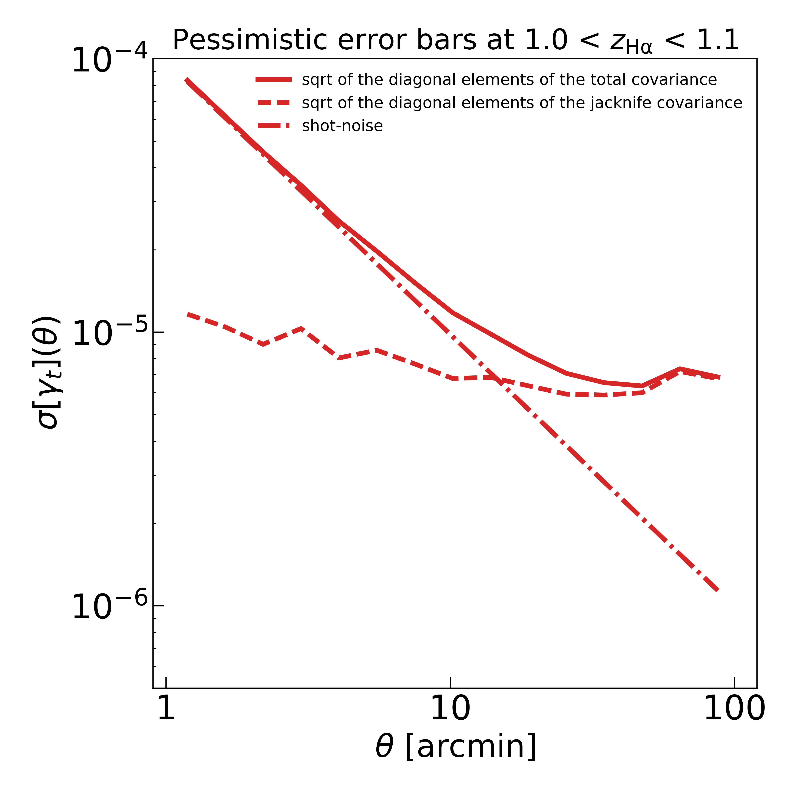
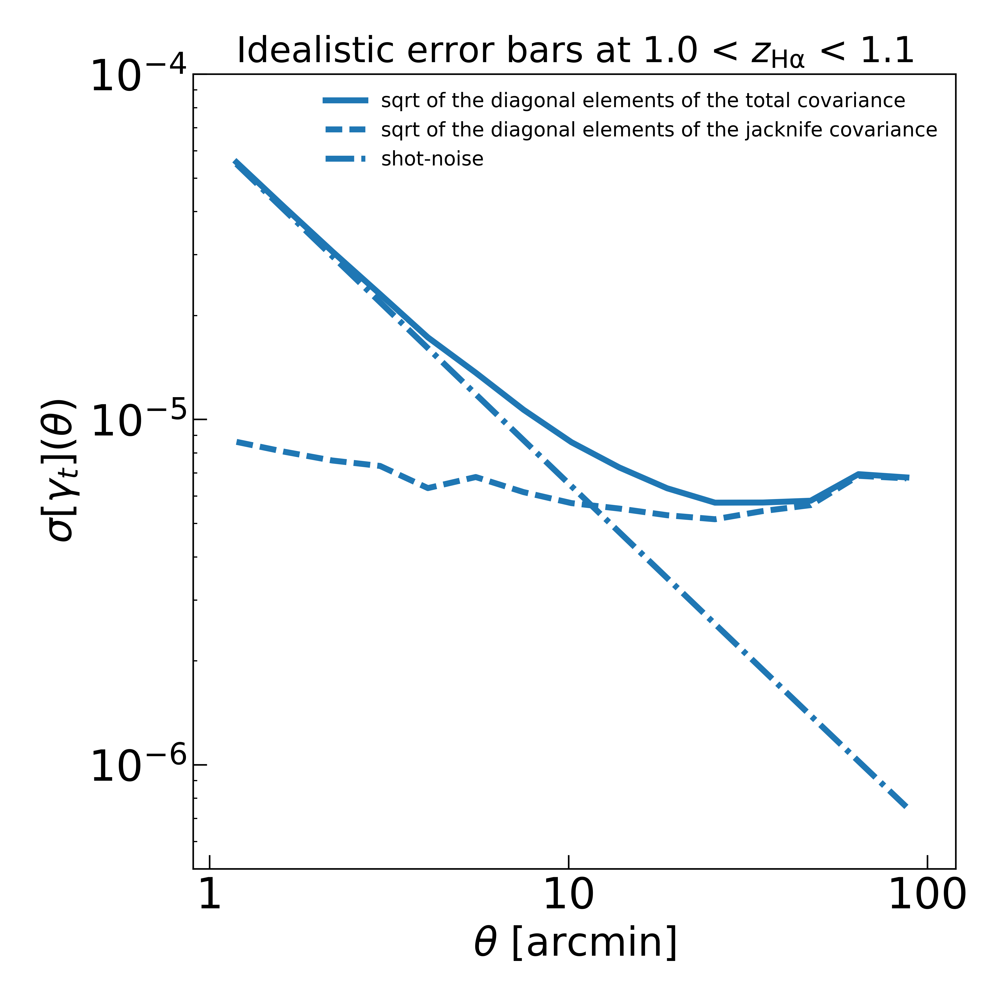
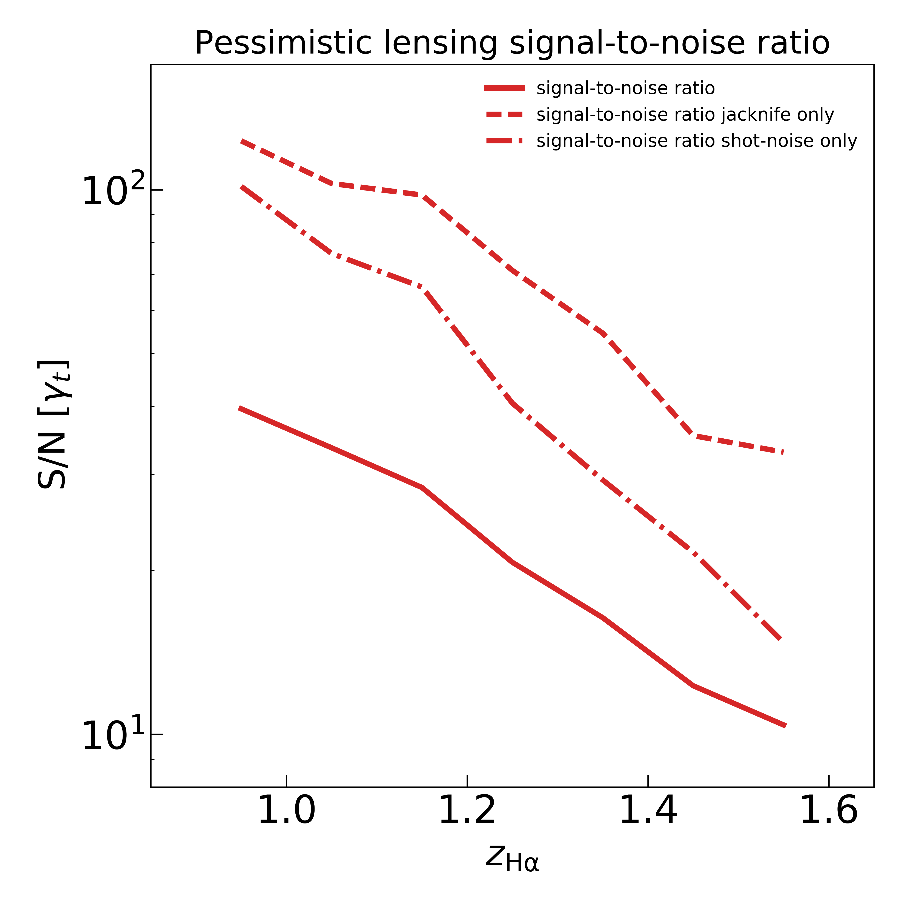
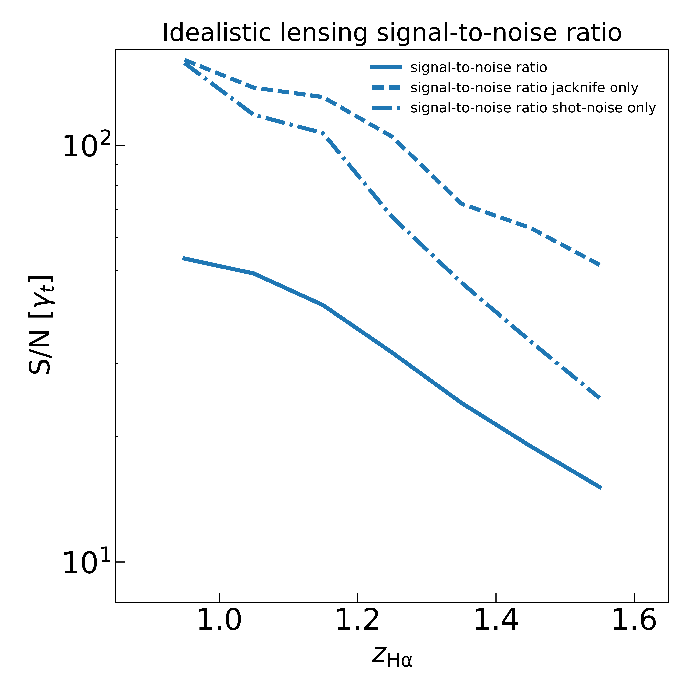
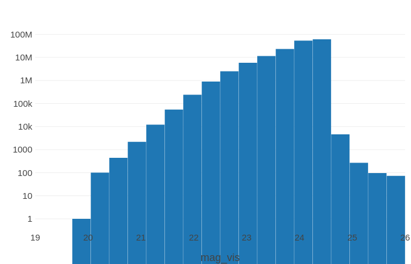
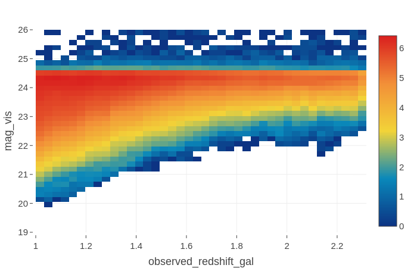
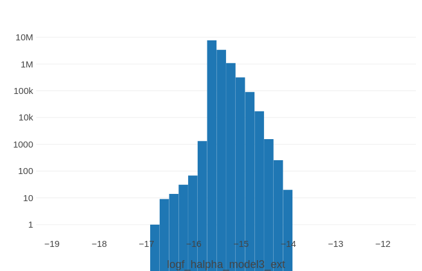
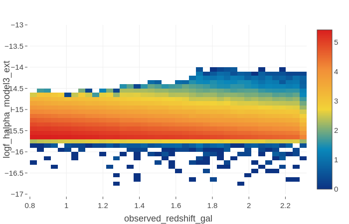

# Forecasting the Halpha lensing signal

## Expected lensing signal around H-alpha emitters 

The pessimistic case occurs when the success rate in estimating the redshifts of Halpha emitters is 
only 45% and the scatter in the estimated photometric redshifts of background sources is 
0.05(1+z). We assume that the individual redshifts are Gaussian distributed.

 

The idealistic case occurs when the success rate is 100% and there is no scatter in the photometric redshifts.

## Contributions to uncertainties

The Poisson shot noise dominates the uncertainty budget on small separations where the number of source-lens 
pairs in a given angular separation is small. On large scales however, the uncertainy is dominated by the sample 
covariance.

## Redshift dependence of the signal-to-noise

As expected the signal-to-noise ratio drops significantly as we measure the lensing around Halpha 
emitters at higher redshifts. It is worth noting that even at the highest redshift bin the signal-to-noise 
remains high ~O(10).

## Effect of magnification on the source catalog

We note that magnification in the source catalog barely adds any new object beyond mvis>24.5.

## Effect of magnification on the Halpha catalog

Lensing magnification adds a significant number of objects with f<2*10**-16 to the sample 
of Halpha emitters.

### Contributors: 

Mohammadjavad Vakili (Leiden Observatory) &
Eric Jullo (Laboratoire d'Astrophysique de Marseille)
